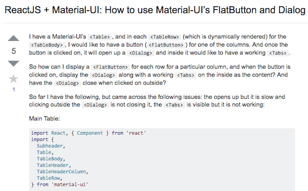

## Meteor: A Love-Hate Relationship

As I have mentioned in previous posts, I am brand new to web-application development. This brings with it some good and bad aspects. I have no previous attachments to web application frame works or tools. I get to listen to the gripes and groans of fellow students as I just embrace learning a whole new concept. There are definitely some disadvantages though. For instance, I am learning Meteor, which functions quite differently from other frame works, and I am enjoying it thus far, but how do I know if this is the best tool! What if the other frame works are better! The more experience student's might be a bit frustrated with the new functionality of Meteor, but at least they have something to compare it to and can go forward in their careers and accurately choose the best tool for the job. Hopefully Meteor is what the professor is selling it to be and I will have a good tool in my tool box for future development.

### The Things I Love

This actually took me some time to conjure up aspects of Meteor that I can truly say I love. At first I thought I might not be able to actually come up with anything, but after some thought, there are definitely aspects of Meteor that I do appreciate. After only a few hours of playing around and going through tutorials, I was able to create a very basic application. This application used a database (MongoDB), function forms, and multiple pages. Going from someone who had no experience with web applications to someone who created a basic application in a short amount of time is very exciting! Things that I thought would be very difficult (data validation in the database, routing between pages) are made very easy by built in libraries and modules. I am confident with enough time, I could legitimately create a descent function application with the skills our class has learned thus far

### With The Good Always Comes The Bad

I am not sure some of these gripes are with Meteor itself or with the software creation process our class was implementing. Either way, I found truely understanding what was happeing a little tricky. I actually am still very foggy on what is happening under the hood in a lot of aspects. Our class started at the bottom and created pieces of applications from the ground up. I love this method. I feel like as each block builds upon eachother I can follow what is happening and look up what is happeing in documentation. This was going great for me! Then all of a sudden, we were given a complicated (probably not complicated, but it seemed like it to a newb) template to build off of. All of a sudden there were a hundred moving pieces that I have never seen and immediately had to start navigating and use. What this caused me to do was learn the specific piece I needed to manipulate and move on. I kept telling myself that I would go back and look up pieces to fully understand what was happening, but lets be honest, something else always pops up with more precedence. I will say that over time more of the pieces have come together. This is probably the learning style closer to immersion, and some people like that. Maybe its the best way, IM not sure, but I was not used to it and it caused me to be very frustrated with Meteor multiple times. I haven't yet weeded out what of my frustrations are with the tool itself or with my lack of understanding of the tool. 

