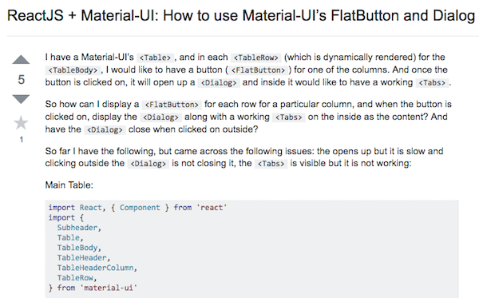

 *"It’s OK to be ignorant; it’s not OK to play stupid" - Eric Raymond*
  
  Have you ever felt annoyed when approached with simple questions from people who are clearly taking the easy route in avoiding their own research in hopes you will just tell them what to do? Maybe you've responded "I'm busy, Google it." This is the world that the most advanced software engineers and developers live in, especially since most basic questions have been asked before and documented in a forum that is easily Google-able.  But at the same time, the technical world can also be very challenging for beginners, so of course a lot of questions need to be asked! Some beginners aren’t sure which questions are considered “dumb” questions or good questions.  Bombarding experts with simple, Google-able questions can waste valuable time. To address this, Eric Raymond provided a really great <a href="http://www.catb.org/esr/faqs/smart-questions.html" style="color: rgb(0,128,255)">article</a> on how to ask smart questions!  This light humored article really helps lay out the types of questions that are likely to gain attention or be thrown to the wayside.  It definitely gave me a better insight into how I can communicate my questions better! As Eric Raymond said “It's OK to be ignorant; it's not OK to play stupid.“
  
  

**Example of Poorly Asked Question:**

- The subject line doesn't indicate what type of problem the user is facing.
- This person pasted a bunch of code without much context on what errors they were getting.
- It was voted down 14 times and the comments are mostly "Ask better questions!" 
- One person even linked to a specific stack overflow post on how to ask good questions. <a href="http://stackoverflow.com/help/how-to-ask" style="color: rgb(0,128,255)">http://stackoverflow.com/help/how-to-ask</a>
- <a href="http://stackoverflow.com/questions/37880319/why-is-the-code-below-not-working" style="color: rgb(0,128,255)">Click here for full Question</a>

**Example of a Good Question!**

- This post has a clear subject line that was specific to the problem.
- The body of the question is very precise and has the full pasted code for others to inspect.
- The problem appears to be something the posted had already atttempted to research on their own.
- It seems to be a good question since it has been viewed many times and with complete and helpful awnsers.
- <a href="http://stackoverflow.com/questions/41711621/reactjs-material-ui-how-to-use-material-ui-s-flatbutton-and-dialog-in-each-ta" style="color: rgb(0,128,255)">Click here for full Question</a>

I have been told many times, from both bosses and professors, that communication in the technical world is vitally important! With this in mind, Eric Raymond’s article addresses a particular aspect of the hacker culture that I think is important to understand. Eric Raymond quoted “What we are, unapologetically, is hostile to people who seem to be unwilling to think or to do their own homework before asking questions.” His point is, value in time, conciseness, productivity, and thirst for challenging problems is often mistaken for cruelty or insensitivity. I ran into this problem a few times working with developers before I entered the computer science field. I was convinced these people hated me! Once I started to understand the culture, I realized it wasn’t personal. I also find myself much more understanding of people with those attitudes. In this field, there is a deep passion for learning and sharing knowledge. However, it’s a quick moving field and those that care enough will put in the time to self educate and bring forward thought provoking, challenging ideas.
