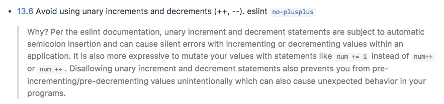

For me, coding standards are not the most exciting aspect of programming, but I will admitt that they are definitely one of the most important concepts to ensure quality software. I think a lot of people see it as a necessary evil. Just as grammar and composition are important to any written language, coding standards set out important guidelines and rules for programs.

As projects grow in size, coding standards become more and more imperative. Coding standards ensure that software written by dozens or even hundreds of people are consistent and efficient. I can only imagine how frustrating it would be to read code from multiple people, all with their own style or nuisances. Even more, fixing bugs with dozen's of different "coding flavors" implemented in the SAME piece of software. It would be a mess and not to mention unprofessional.

With all this being said, I understand the initial frustration with it! For example, I have grown really fond of using (i++) to increment the value of i up one. It turns out, it is frowned upon by the coding standards we are using for our projects in my software engineering course. We are using the Airbnb JavaScript Style Guide with Eslint. Take a look...

  I guess they have a pretty good reason. I'm sure I'll adjust for the greater good of coding. My experience with coding standards for the most part hasn't been too bad. I am getting used to functional programming in general, which has a lot to do with most of the errors in my code. All in all, coding standards are a necessary evil I'm happy to embrace.
